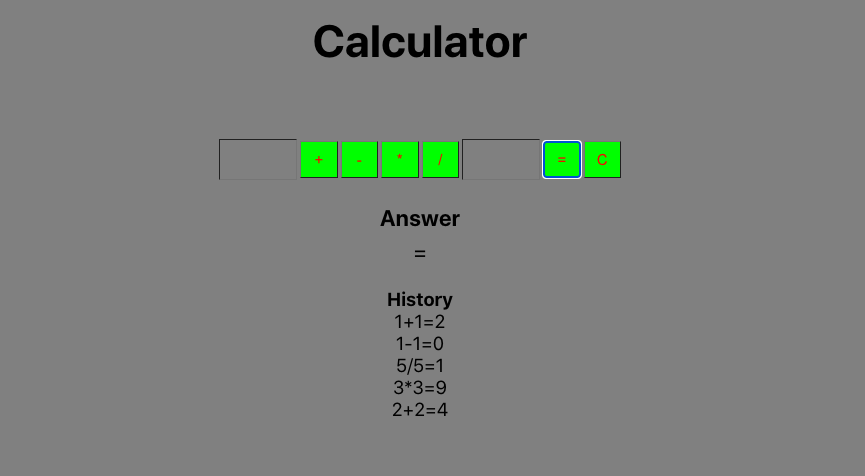

# Sezzle calculator challenge

## Description

This app is a simple calculator that does simple math and maintains a history of the 10 most recent calculations.

## Screen shot

## Prerequisites
- React

## Installation
1. Open your chosen code editor and run `npm install`.
2. Run `npm start` in your terminal which will run the app in the development mode. 
Open [http://localhost:3000](http://localhost:3000) to view it in the browser.

## Built With
- React
- Javascript
- HTML
- CSS

## Support
For suggestions or issues, please email me at erick.jensen010@gmail.com

